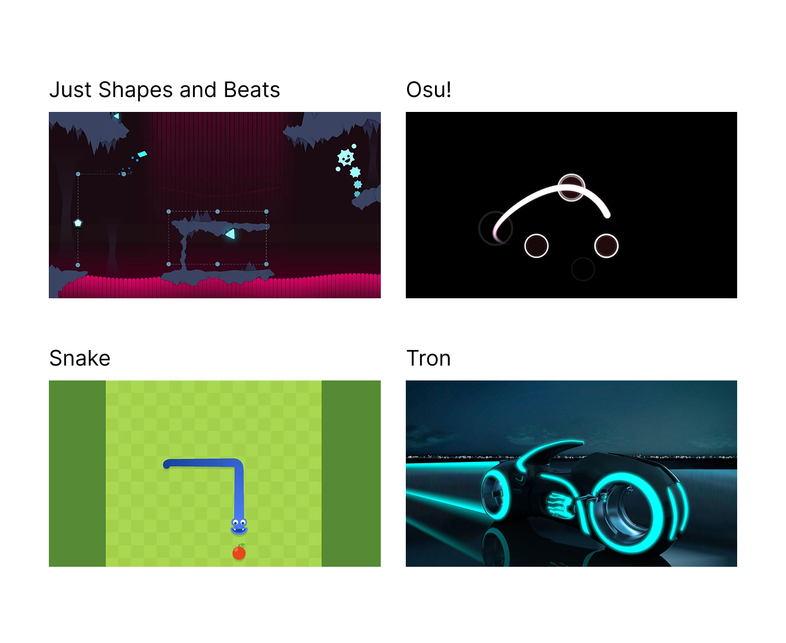

# Concept

## Le pitch initial

<!-- Inclure la vidéo du PowerPoint intial -->

<!-- Méthode 1 -->
<iframe width="560" height="315"
  src="https://www.youtube.com/embed/S0HuyAs4G5k?si=4g17DAnrrll7XO7B"
  title="YouTube video"
  frameborder="0"
  allowfullscreen>
</iframe>

<!-- Méthode 2, plug legit -->
<!-- 

-->

<!-- Méthode 3 (vidéo local) -->
<!-- 
 
-->

## L'expérience

En entrant dans le grand studio, les personnes prennent une manette et regardent la projection sur le mur. L écran affiche une courte intro et explique les bases en quelques secondes. La partie démarre avec un niveau tutoriel: chacun bouge son curseur, une ligne suit sa trajectoire et devient un obstacle pour les autres. Les joueurs réalisent vite qu ils doivent communiquer, se laisser de l espace et s entraider pour ouvrir des passages. Si quelqu un est éliminé, tout le monde recommence le niveau: on apprend par essais et erreurs, ensemble. Plus on avance, plus les niveaux combinent de nouvelles mécaniques et montent en difficulté, créant des moments de tension, de rire et de coopération.

### Le parcours de l'interacteur

En entrant dans le studio, l'interacteur prend une manette et voit son curseur coloré apparaître sur la projection. Les premiers niveaux tutoriels lui montre l'essentiel: se déplacer au joystick et maintenir un bouton pour activer des éléments. Il expérimente, réalise que sa trace reste et devient un obstacle, puis ajuste sa trajectoire et son rythme. Très vite, il se coordonne avec les autres: annoncer son passage, ouvrir un bouton-porte pour un coéquipier, attendre la bonne fenêtre de timing face aux obstacles mobiles. À chaque élimination, toute l'équipe redémarre, ce qui pousse à observer, proposer une stratégie et mieux se synchroniser. De niveau en niveau, il découvre une nouvelle mécanique, combine celles déjà apprises, gagne en précision et en communication, jusqu'à ce que les six joueurs franchissent ensemble la sortie et enchaînent vers un niveau plus exigeant.

<!-- 
Comportement de l’interacteur
Qu'est-ce que fait l'interacteur?
un résumé du parcours de l'interacteur du début à la fin de son expérience - qu'est-ce qu'il fait, qu'est-ce qu'il manipule, etc
-->

### L'espace

Le projet se déroule dans le grand studio avec une large projection au mur. Au sol, une zone dégagée permet aux joueurs de se regrouper devant l'écran, tandis que six manettes sont posées sur une table (ou distribuées) près de l'entrée. La lumière est douce pour garder le focus sur l'image projetée, et le son provient de haut-parleurs proches de l'écran pour renforcer la sensation d'immersion. Dans l'espace virtuel, l'aire de jeu est claire et contrastée: chaque joueur a une couleur distincte, son curseur est bien visible et sa trace l'est aussi. Les éléments interactifs (boutons, portes, obstacles mobiles) sont lisibles à distance et répondent immédiatement aux actions des manettes. Le réel et le virtuel se rejoignent simplement: la manette contrôle directement le curseur de même couleur, les retours visuels et sonores confirment chaque action.

<!-- 
description de l'espace réel et virtuel du projet et comment l'espace réel est transposé, transorté ou prolongé dans le virtuel et inversement 
-->

### La progression

Le premier niveau est un petit tutoriel. Ensuite, à chaque nouveau niveau, les joueurs découvre une nouvelle mécanique. Une fois toutes les mécaniques présentées, les niveaux suivants les combinent, idéalement générés aléatoirement. Plus on avance, plus les niveaux deviennent difficiles. 

<!--  sur le temps et la progression -->

### L'aspect collectif

***TERMINAL*** est pensé pour le collectif: jusqu'à six personnes jouent en même temps, avec un objectif unique et partagé. Chaque joueur contrôle un curseur, mais la trace qu'il laisse influence tout le groupe. La réussite dépend de la coordination: ouvrir un passage pour un autre, attendre son tour, choisir qui mène et qui sécurise. Si une personne est éliminée, tout le monde recommence: la responsabilité est vraiment commune. Le level design encourage la coopération avec des boutons à tenir, des timings à synchroniser et des zones étroites à négocier ensemble. Le projet transforme un groupe d'individus en une équipe qui apprend, s'ajuste et progresse ensemble.

<!-- 
comment votre idée de projet correspond au thème du COLLECTIF 
Plus il y a de personnes qui peuvent interagir simultanément est un critère important ! 

Un collectif désigne l'ensemble de personnes ou d'entités qui s'unissent de manière concertée pour poursuivre un objectif commun, en coopérant et en collaborant pour atteindre des buts qui seraient difficiles à réaliser individuellement.
 Il peut s'agir d'une réunion informelle ou contractuelle, temporaire ou durable, constituée autour d'une cause, d'une action ou d'un projet, qu'il soit artistique, politique, professionnel, moral ou cultuel.
 Ce groupe, souvent considéré comme une entité à vocation communautaire, fonctionne sous le pilotage de ses membres et repose sur une volonté partagée de développer des solidarités.
-->

### L'aspect social

Le jeu crée des interactions directes: on parle, on négocie des stratégies, on s'excuse quand on bloque un coéquipier, on se répartit les rôles. Les boucles d'essai-erreur favorisent l'écoute et la bienveillance: on observe ce qui a raté, on propose une autre approche, on réessaie. La règle de redémarrage collectif renforce l'entraide et évite le chacun pour soi. L'entrée en matière est simple (prendre une manette, bouger), ce qui inclut rapidement des profils variés et met l'accent sur la collaboration plutôt que la performance individuelle. Peu à peu, la confiance s'installe: les joueurs anticipent les mouvements des autres, communiquent mieux et vivent une réussite commune qui rapproche le groupe.

<!-- 
comment votre idée de projet correspond au thème du SOCIAL 

Le terme « social » désigne ce qui concerne la vie en société, c’est-à-dire les relations entre les individus au sein d’un groupe organisé, ainsi que les structures, normes et institutions qui en découlent.
 Il peut s’appliquer à des aspects variés, comme la vie sociale, les groupes sociaux, les classes sociales, les rapports de production, ou encore les politiques visant à améliorer les conditions de vie des individus.
 En sciences sociales, le social englobe l’étude des phénomènes collectifs, des interactions humaines, des normes sociales et des dynamiques de pouvoir au sein de la société.
 L’adjectif peut aussi qualifier des animaux ou des plantes vivant en communauté selon des règles strictes, comme les insectes sociaux (fourmis, abeilles) ou certaines espèces végétales formant des colonies denses.
-->

## Inspirations

### Inspirations visuelles et sonores

### Images inspirantes

### Palette

<!-- Inclure le moodboard avec référenes pour chacune des sources-->

<!--
Images inspirantes
Représentations visuelles de l'ambiance recherchée, que ce soit à travers des photographies, des illustrations, ou des œuvres existantes.

Palette de couleurs
Choix de couleurs qui influenceront l’éclairage, les médias projetés, ou l’interface visuelle.

Références multimédia
Vidéos, musiques ou sons, séquences animées qui capturent l’énergie ou la tonalité souhaitée pour l'installation.

Textures et matériaux
Échantillons ou représentations de matériaux tangibles qui seront utilisés dans l'installation (écrans, surfaces tactiles, objets physiques interactifs).

Ambiance sonore et lumineuse
Inspirations relatives à la scénarisation de la lumière et du son, qui seront des éléments interactifs clés dans l’expérience utilisateur.
-->

### Inspirations interactives

<!-- Inclure des liens et une ligne sur pourquoi -->

## Scénarimage

<!-- Pour chaque étape/scène : une image avec du texte descriptif et une explication de la transition -->

<!--
Éléments du scénarimage
Séquence visuelle
Chaque scène ou séquence du scénarimage doit être clairement illustrée, montrant les éléments visuels qui seront projetés ou affichés. Cette séquence visuelle peut inclure des captures d'écran, des croquis ou des rendus 3D, en fonction des besoins du projet.

Points d'interaction
Le scénarimage dans un cadre interactif inclut les moments où l'utilisateur interagit avec l'installation. Ces points d’interaction doivent être représentés graphiquement pour indiquer comment et quand l’utilisateur influencera la progression du récit ou des effets visuels et sonores.

Évolution du récit
Comme pour le scénario narratif, le scénarimage doit montrer la progression de l’histoire ou de l’expérience au fil des interactions. Il permet de visualiser comment l’installation évolue en fonction des actions de l'utilisateur, avec des embranchements possibles selon ses choix.

Retour visuel et sensoriel
Le scénarimage doit inclure des annotations ou des visuels montrant les réponses visuelles, sonores ou tactiles à chaque interaction. Cela peut inclure des changements d’éclairage, des transitions vidéo, ou des effets sonores qui réagissent aux actions de l’utilisateur.
-->
