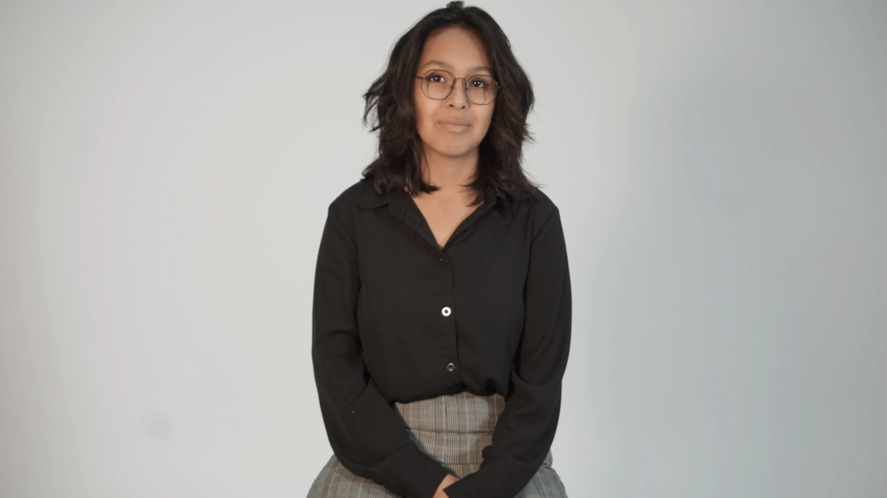

# Dana Saavedra-Torrano

 <!--
À la session 6, 
- Au début de la semaine : 
    - Objectifs de la semaine
- À la fin de la semaine :
    - Explication détaillée des tâches accomplies
    - Documentation multimédia des tâches accomplies
 -->

# Planification

## Semaine 1
- Mettre à jour le site web du projet
- Lister les designs à faire
- Se diviser les tâches

## Semaine 2
- Les boutons ( flèches de la mannette)
- Le visuel des joueurs
- Les murs/portes/gates
- Les powers up
- Cadenas
- Installation des bars LED

## Semaine 3
- Finalisation des visuels
- Finalisation de l'installation, donc les bars LED

## Semaine 4
- Correction du travail présentais
- Révisions du logo

## Semaine 5
- Conception des niveaux

## Semaine 6
- Conception des niveaux( finir les niveaux manquants)

## Semaine de rattrapage
- Création de la première partie de la cinématique
- 

## Semaine 7
- Documentation
- Bande d'annonce 

## Semaine 8
- Présentation du projet

 

# Journal de bord

## Semaine 2

### Lundi

### Mardi
Remise de la planification

### Mercredi

### Jeudi

### Vendredi

## Semaine 3

### Lundi

### Mardi

### Mercredi

### Jeudi
Remise maquette 1

### Vendredi

## Semaine 4

### Lundi

### Mardi

### Mercredi

### Jeudi

### Vendredi

## Semaine 5

### Lundi

### Mardi

### Mercredi

### Jeudi

### Vendredi

## Semaine 6

### Lundi

### Mardi
Remise bande-annonce vidéo - dossier de presse - maquette 2

### Mercredi

### Jeudi

### Vendredi

## Semaine de rattrapge

### Lundi

### Mardi

### Mercredi

### Jeudi

### Vendredi

## Semaine 7

### Lundi

### Mardi

### Mercredi

### Jeudi

### Vendredi
