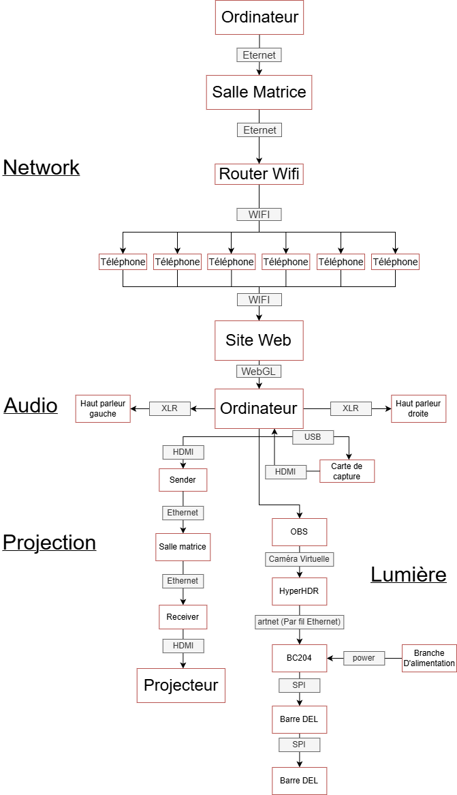
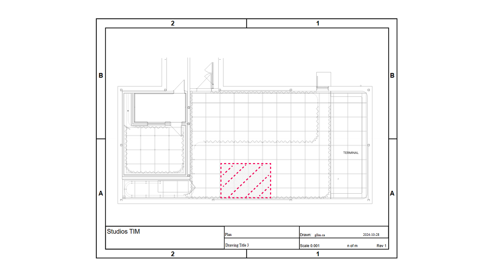
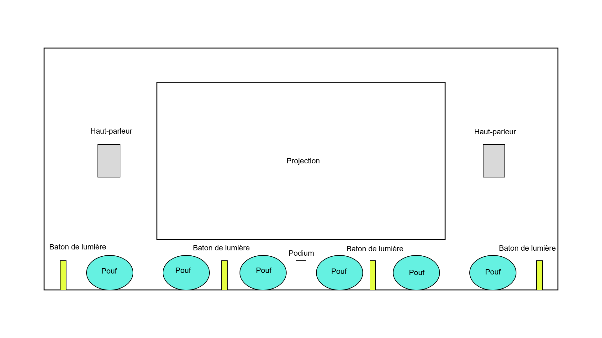
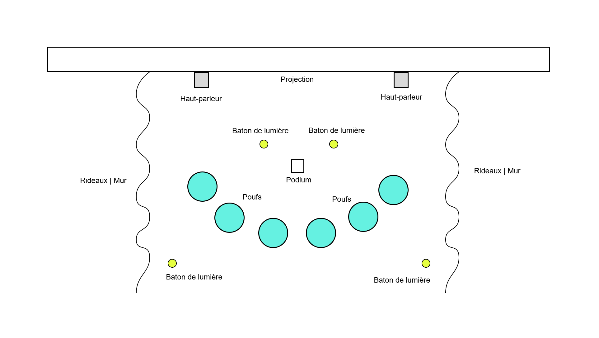
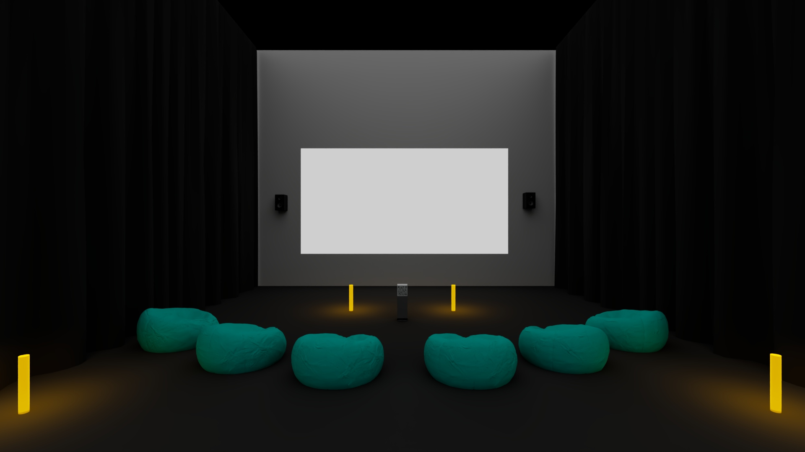
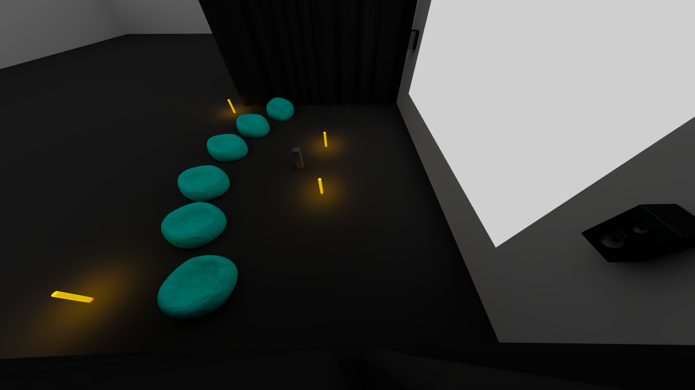
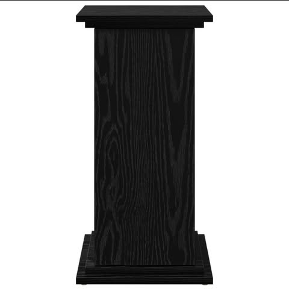
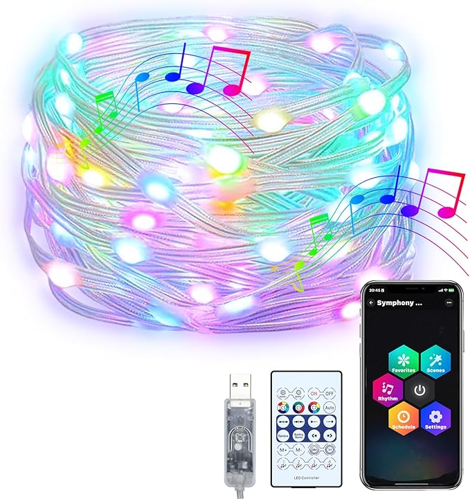

# Scénarisation

## Scène 1

| Verbe Action              | Condition de déclenchement                                                                                                                                                                                |                                                                                                                                                                                                                  Effet visuel |                                                                                                              Effet sonore |                                                Effet interactif |
| :------------------------ | :-------------------------------------------------------------------------------------------------------------------------------------------------------------------------------------------------------- | ----------------------------------------------------------------------------------------------------------------------------------------------------------------------------------------------------------------------------: | ------------------------------------------------------------------------------------------------------------------------: | --------------------------------------------------------------: |
| S'asseoir et scanner | Le joueur s'asseoit et se connecte avec son téléphone grâce à un code QR qu'il va balayer et se connecte au wifi de notre jeu. L'interface de manette sur son téléphone sera afficher dans un navigateur. | Il voit son appareil qui se transforme en manette et voit qu'un nom et une couleur lui est assigné sur son appareil et voit son joueur apparaître dans le jeu avec sa couleur et nom. Quand il est dans le menu, il peut visuellement voir tous les joueurs qui sont présentement dans le jeu. |     Il entend la musique du jeu du menu. Quand un joueur se connecte, un effet sonore se fait entendre pour tout le monde | Ajout d'un joueur dans le jeu et connection wifi pour le joueur |
| Partir et se déconnecter  | Le joueur part et se déconnecte de son téléphone quand il perd connection du navigateur.                                                                                                                  |                                                                                                                                                               Il voit visuellement dans le menu qu'il n'est plus dans le jeu. |                                Tout le monde entend le son de déconnection d'un joueur. La musique du menu joue toujours. |                                 Retire d'un joueur dans le jeu. |
| Appuyer sur 'Prêt'       | Le joueur clique sur le bouton Prêt sur son téléphone, quand tous les joueurs sont prêt, commence l'histoire, quand celui-ci est finit, un petit tutoriel est montré et ensuite le premier niveau est commencé                                                                                                                                                        |                                                                                                                                   Il voit la scène afficher, avec le projecteur, changer du menu principal a la description de l'histoire et ensuite au premier niveau après un petit tutoriel. | Il entend un bruit SFX de bouton et la musique du menu qui graduellement change à la musique d'ambiance du premier niveau |                              La scène change au premier nouveau |                                                                Il entend un bruit SFX de bouton et la musique du menu. |

## Scène 2

| Verbe Action                 | Condition de déclenchement                                                                                   |                                                                                                                                    Effet visuel |                                                                                                   Effet sonore |                                                                                                                                                                                   Effet interactif |
| :--------------------------- | :----------------------------------------------------------------------------------------------------------- | ----------------------------------------------------------------------------------------------------------------------------------------------: | -------------------------------------------------------------------------------------------------------------: | -------------------------------------------------------------------------------------------------------------------------------------------------------------------------------------------------: |
| Appuyer sur 'Flèches'        | Durant le jeu, le joueur clique sur les flèches directionnelles sur son téléphone                                              |                                                                                  Le personne du joueur se déplace en fonction de la flèche appuyé |                                                      Un effet sonore de déplacement de joueur se fait entendre |                                                                                                 Le joueur se déplace dans le jeu et une ligne se créer quand il se déplace qui devient un obstacle |
| Un joueur se déplace dans un obstacle                 | Durant le jeu, le joueur fonce sur un obstacle ou dans un autre joueur                                       |                                                                      Flash rouge sur l'écran quand un joueur meurt et ouvre écran d'élimination |                     Un effet sonore fort quand il meurt et une musique de défaite sur le menu se fait entendre |                                                                                                                                                   Le menu de d'élimination est affiché sur l'écran |
| Attendre pour recommencer    | Dans le menu d'élimination, le joueur attend que le niveau recommence après quelques secondes                                 |                                                                                                                           Le niveau est affiché |                                                                  Un effet sonore de début de niveau se fait entendre |                                                                                                                                              Recommence le niveau et affiche le niveau sur l'écran |
| Tout les joueurs se déplace sur la fin               | Durant le jeu, tout les joueurs se rendent à la fin sans être éliminé                                        |                                                            Flash de couleur sur l'écran quand un joueur meurt et ouvre écran de prochain niveau | Un effet sonore fort quand il gagne et une musique de victoire sur le menu de prochain niveau se fait entendre |                                                                                                                                                 Le menu de prochain niveau est affiché sur l'écran |
| 1 joueur se déplace sur la fin           | Dans le jeu, un joueur se rend jusqu'au point final                                                          |                                                                                               L'avatar du joueur disparait, mais sa ligne reste |                                                                 Un effet sonore de Finisition se fait entendre |                                                                                    Rajouter le joueur dans ceux qui on finit et le joueur perd le controle de son avatar durant le reste du niveau |
| Déplacer un personnage sur une 'Plateforme'  | Durant le jeu, le joueur met son personnage sur une plateforme pour ouvrir une porte                         |                                                                                             La plateforme change de couleur et la porte s'ouvre |                                  Un son de porte qui s'ouvre et d'activation de la plateforme se fait entendre |                                                                  La plateforme qui a un joueur dessus, va ouvrir sa porte qui est correspondante, pour ouvrir une voie à un autre joueur ou chemin |
| Déplacer un personnage sur un 'PowerUp'     | Durant le jeu, le joueur met son personnage sur un power up et obtient le pouvoir                            |                         Dépendant du power up, l'effet change, si powerup qui enlève la ligne derrière le joueur, la ligne disparait de l'écran |                                                              Un son de power up correspondant ce fait entendre | Le power up qui a un joueur dessus, va donner au joueur l'effet correspondante, si power up qui enlève la ligne du joueur, enlève la progression de sa ligne complètement et recommence à la créer |
| S'asseoir et scanner    | Le joueur s'asseoit et se connecte avec son téléphone grâce à un code QR et se connecte au wifi de notre jeu | Vois son appareil qui se transforme en manette et vois qu'un nom et une couleur lui est assigné et voit son joueur apparaître dans le jeu avec sa couleur et nom quand le level finit, il doit attendre que le level courant se finit |         Il entend la musique du jeu, quand il se connecte, un effet sonore se fait entendre pour tout le monde |                                                                     Ajout d'un joueur dans le jeu et connection wifi pour le joueur, mais attend le prochain niveau avant de le mettre dans le jeu |
| Partir et se Déconnecter     | Le joueur se lève et ferme le site web sur son téléphone                                                     |    La manette n'est plus sur son téléphone, un menu temporaire montre aux autres joueurs qu'il s'est déconnecté et le niveau recommence ensuite |                                    Quand il se déconnecte, un effet sonore se fait entendre pour tout le monde |                                                                                         Enlever un joueur du jeu, montrer l'écran de déconnection et recommencer le niveau avec un joueur en moins |

## Scène 3

| Verbe Action                                 | Condition de déclenchement                                                                                                                                                                                      |                                                                                                                                                                                                                  Effet visuel |                                                                                                              Effet sonore |                                                                Effet interactif |
| :------------------------------------------- | :-------------------------------------------------------------------------------------------------------------------------------------------------------------------------------------------------------------- | ----------------------------------------------------------------------------------------------------------------------------------------------------------------------------------------------------------------------------: | ------------------------------------------------------------------------------------------------------------------------: | ------------------------------------------------------------------------------: |
| Le joueur réussi à terminer tous les niveaux | Réussir tous les niveaux                                                                                                                                                                                        |                                                                                                                              Il voit la scène afficher, avec le projecteur, changer du dernier niveau à une scène de victoire, après un certain temps, le jeu retourne au menu principal. |                       Il entend des bruits SFX du jeu qui termine, la musique change à la musique d'ambiance de victoire. |                                          La scène change à la scène de victoire |
| S'asseoir et scanner                    | Un joueur s'asseoit et peut se connecter avec son téléphone grâce à un code QR qu'il va balayer et se connecte au wifi de notre jeu. L'interface de manette sur son téléphone sera afficher dans un navigateur. | Il voit son appareil qui se transforme en manette et voit qu'un nom et une couleur lui est assigné sur son appareil et voit son joueur apparaître dans le jeu avec sa couleur et nom. Quand il est dans le menu, il peut visuellement voir tous les joueurs qui sont présentement dans le jeu. |        Il entend la musique de victoire. Quand un joueur se connecte, un effet sonore se fait entendre pour tout le monde |                 Ajout d'un joueur dans le jeu et connection wifi pour le joueur |
| Partir et se déconnecter                     | Le joueur part et se déconnecte de son téléphone quand il perd connection du navigateur.                                                                                                                        |                                                                                                                                                              Il voit visuellement dans la scène qu'il n'est plus dans le jeu. |                            Tout le monde entend le son de déconnection d'un joueur. La musique du victoire joue toujours. |                                                 Retire d'un joueur dans le jeu. |

# Équipements

- Ordinateur principal sur chariot (1): PC de contrôle exécutant Unity, gère le jeu, les connexions et la projection.

- Projecteur (1): Projection murale grand format pour afficher la zone de jeu commune.

- Tablettes / phones (1-6): Contrôleurs utilisés par les joueurs (connexion Wi-Fi).

- Routeur Wi-Fi (1): Permet la connexion des téléphones si le jeu est accessible via navigateur mobile.

- Haut-parleurs amplifiés (2): Diffusion stéréo des sons du jeu pour renforcer l’immersion collective.

- Sender / Receiver (1 chaque): Permet de connecter le cable video de l'ordinateur vers le projecteur.

- Cables Ethernet (3 à 4): Connectez les matériaux à l'internet

- Câbles vidéo (1): HDMI ou DisplayPort reliant le PC au projecteur.

- Câbles audio (2): XLR pour relier la sortie audio aux haut-parleurs.

- Câbles d’alimentation: Selon les haut-parleurs et le projecteur.

- Multiprise / rallonge électrique – Pour alimenter l’ensemble du système.

- Lumière plafond American DJ

- Lumière Baton (2-4): Mettre de la lumière d'ambiance qui change avec une donné en boucle

- Boite de lumière (1): Permet de brancher les lumière en daisy chain et les reliers à l'ordinateur

- Ralonges pour lumières (2-4) Brancher les lumières mêmes si elles sont loins l'une et l'autre

- Power supply pour boite à lumière: Donner le power à la boite à lumières

- Boules de connections de lumières (2): Faire tenir les lumières droites

- Carte graphique extérieur (1): Pour projeter les données vers les couleurs de lumières

# Logiciels

- Moteur principal : Unity (développement du jeu, gestion des manettes, affichage sur grand écran)

- Langages et environnements: C#, Unity

- Projection: Unity en plein écran (sur projecteur)

- Audio: Reaper (création, mixage et exportation des pistes sonores)

- Gestion d’éclairage: Hyper HDR

- Capteurs: Aucun capteur physique requis

# Synoptique

# Plan d'implantation 2D et 3D

# Budget estimé

| Nom du produit         | Image                                                                                                                                                                                                    | Quantités | Prix avec taxes |
| ---------------------- | -------------------------------------------------------------------------------------------------------------------------------------------------------------------------------------------------------- | --------- | --------------- |
| Pouf gonflable         |  | 6         | 275,94$         |
| Podium code Qr         |                                                           | 1         | 110 $           |
| Fairy Lights                 |                                                                                                                                                                                          | 1         | 18$            |
| Total                  |                                                                                                                                                                                                          |           | 403.94$        |
